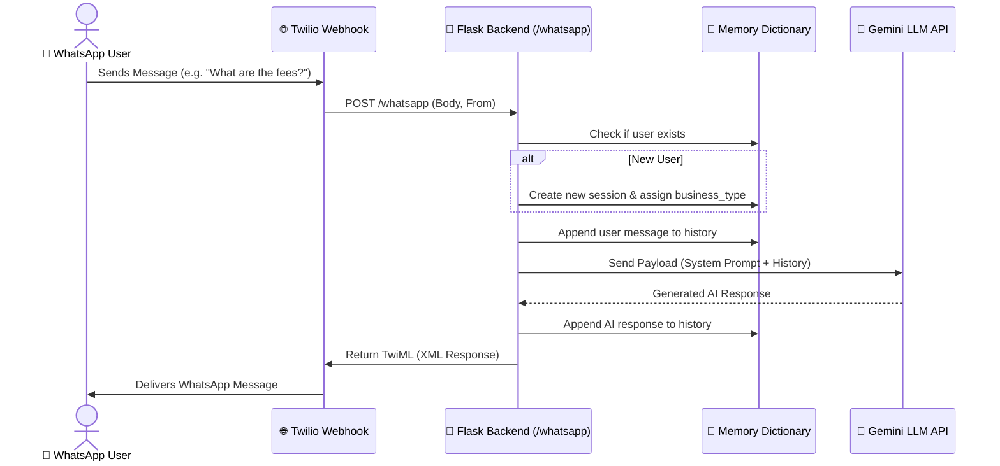

<div align="center">
  <h1>📱 WhatsApp LLM Bot</h1>
  <p><strong>A powerful, context-aware Flask conversational API bridging WhatsApp (via Twilio) and LLMs (via Gemini/OpenAI endpoints)</strong></p>
</div>

<br/>

## 🌟 Overview

This project is a fully functional, production-ready WhatsApp chatbot backend. It exposes a Flask-based REST API that accepts user messages (both directly via API and via Twilio WhatsApp webhooks) and generates intelligent responses using Large Language Models. 

The bot is designed with **memory**, meaning it retains the conversation context for each unique user, enabling human-like, seamless, and context-aware interactions.

### ✨ Key Features
- **WhatsApp Integration:** Native integration with the Twilio WhatsApp API for seamless messaging.
- **Context-Aware Memory:** Maintains a conversation history dictionary so the AI remembers what was said earlier in the chat.
- **LLM Compatibility:** Powered by the OpenAI Python SDK pointing to Google's highly efficient Gemini API compatible endpoints.
- **Role-Based Prompts:** Easily switch behavior (e.g., Coaching Assistant) by utilizing System Prompts.
- **Conversation Management:** Export user chat histories directly into JSON files or clear them dynamically.
- **Deployment Ready:** Ships with a `Procfile` configured for `gunicorn`, ready to be deployed on platforms like Railway, Render, or Heroku.

---

## 🛠️ Tech Stack

- **Backend Framework:** Python & Flask
- **AI Integration:** OpenAI Python SDK & Google Gemini (gemini-1.5-flash)
- **WhatsApp API:** Twilio
- **Environment Management:** python-dotenv
- **Production Server:** Gunicorn

---

## 🚀 Getting Started

### 1. Clone the repository
```bash
git clone https://github.com/siddhant-tongia/whatsapp-llm-bot.git
cd whatsapp-llm-bot
```

### 2. Install dependencies
Ensure you have Python installed, then run:
```bash
pip install -r requirements.txt
```

### 3. Set up your Environment Variables
Create a file named `.env` in the root of your folder and add your credentials:
```ini
# Google Gemini API Key (Accessible via Google AI Studio)
API_KEY=your_gemini_api_key_here

# Twilio Console Credentials
TWILIO_ACCOUNT_SID=your_twilio_sid_here
TWILIO_AUTH_TOKEN=your_twilio_auth_token_here

# Twilio Sandbox Number (Must include the 'whatsapp:' prefix)
TWILIO_WHATSAPP_NUMBER=whatsapp:+14155238886
```

### 4. Run the Application
Start the Flask development server:
```bash
python app.py
```
*Your API will be running on `http://localhost:8080` (or `5000`).*

---

## 📞 Connecting to WhatsApp (Twilio Sandbox)

1. Sign up for a [Twilio Account](https://www.twilio.com/) and navigate to **Messaging > Try it out > Send a WhatsApp message**.
2. Connect your personal WhatsApp to the sandbox by sending the provided join code.
3. In Twilio, configure the **Sandbox Webhook URL** for incoming messages:
   - **For local testing:** Use a tool like [ngrok](https://ngrok.com/) to expose your local port (`ngrok http 8080`) and set your webhook to `https://<your-ngrok-url>/whatsapp`.
   - **For production:** Use your deployed domain (e.g., `https://your-railway-app.up.railway.app/whatsapp`).

---

## 🔄 System Architecture & Message Flow

When a user sends a message on WhatsApp, it triggers a chain of events spanning Twilio, your Flask backend, and the Gemini API.



### ⚙️ How the Code Works Step-by-Step

1. **Incoming Message Receiver (`/whatsapp`)**: Twilio forwards the WhatsApp message to the Flask API. The code extracts `user_input` and `user_id`.
2. **Memory & Context Management**: The app checks the global `conversations = {}` dictionary. If the user is new, it initializes a blank state. Their message is appended.
3. **LLM Generation**: The system attaches the **System Prompt** (rules and business knowledge) to the conversation. The complete history is sent to Google's Gemini-1.5-Flash model.
4. **Outgoing Dispatch**: The AI's reply is appended to the dictionary and returned as a Twilio `MessagingResponse` (TwiML).

> **Note on State:** The current architecture is **stateful in-memory**, meaning if the Flask server restarts, the conversation history is lost. For production scaling, consider replacing the `conversations` dictionary with a database like Redis or MongoDB.

---

## 🛣️ API Endpoints Reference

Beyond the main WhatsApp integration, `app.py` exposes several auxiliary endpoints to manage the bot's memory and analytics.

| Endpoint | Method | Purpose | Key Operations |
| :--- | :--- | :--- | :--- |
| `/whatsapp` | `POST` | Primary entrypoint for WhatsApp messages. | Extracts `Body` & `From`, manages context, calls LLM, and returns TwiML string to Twilio. |
| `/chat` | `POST` | Standard REST API alternative to WhatsApp. | Accepts JSON `{'user_id', 'message', 'business_type'}`, processes LLM logic, returns JSON response. |
| `/history/<id>` | `GET` | Retrieve conversation history. | Looks up `user_id` in the `conversations` dictionary and returns message list. |
| `/clear/<id>` | `POST` | Delete user memory context. | Resets the `"messages"` array for a specific user to `[]`. |
| `/analytics/<id>`| `GET` | Individual user stats. | Counts total user messages and total conversation turns for a specific user. |
| `/analytics` | `GET` | Global application stats. | Aggregates data across all active users in the memory dictionary. |
| `/export/<id>` | `GET` | Download chat history. | Converts a user's message array into a JSON file (`BytesIO`) and triggers a file download for the client. |
| `/send_whatsapp` | `POST` | Proactive outbound messaging. | Uses the Twilio Client API (`twilio_client.messages.create`) to initiate a conversation with a user directly instead of waiting for a webhook. |

---

## 🎓 What I Learned Building This

- Managing sensitive credentials using `.env` environment variables.
- How REST APIs function (distinguishing between `GET` and `POST` methods).
- Utilizing the OpenAI Python library with compatible endpoints (like Gemini).
- Engineering conversation memory for Large Language Models.
- Parsing and returning dynamic files (JSON data to bytes) for client downloads.
- Integrating Twilio's TwiML and Account SID/Auth Tokens to bridge Python to WhatsApp.
- Preparing a Flask application for production deployment using `gunicorn` and `Procfile`.
